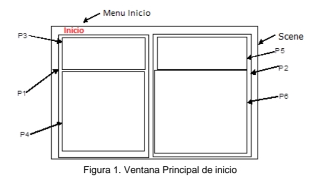

# Documentaci'on Interfaz Gr'afica Ptython

- Generalidades
    
    - Las medidas indicadas corresponden a una medida porcentual de ancho por alto (Width A x Hight B) respecto a la referencia que se indica

    - Tipos de objetos por prefijo:

        - bt -> Button
        - fr -> Frame
        - img -> Image
        - txt -> Texto
        - ent -> Entry
        - mnu -> Menu


## Contenido por ventanas

## Ventana de inicio



La ventana de inicio est'a compuesta por los siguientes elementos, en la jerarquia dada:

1. Scene
    1.1. menu mnuInicio
        1.1.1. menu mnuDescripci'on
        1.1.2. menu mnuSalir
    1.2. frame frP1
        1.2.1. frame frP3
            1.2.1.1. texto txtSaludo
        1.2.2. frame frP4
             1.2.2.1. image imgSistema
             1.2.2.2. button btVentanaPrincipal
    1.3.3. frame frP2 
    
        **Vista 1**
        1. frame frP5
            1. texto txtHV (Hoja de vida)
        2. frame frP6
            1. image imgHV1
            2. image imgHV2
            3. image imgHV3
            4. image imgHV4

        Vista 2
        1. texto txtDescripci'onSistema

---

### 1. Scene

Contenido: mnuPM, frmP1 y frmP2.

#### Medidas y ubicaci'on

**Nota**: Medidas dadas respecto al Scene.

- mnuInicio
    - Medidas: No aplica
    - Ubicaci'on: Parte superior

- frmP1
    - Medidas: W 50 x H 100
    - Ubicacion:Parte inferior izquierda 

- frmP2
    - Medidas: W 50 x H 100
    - Ubicacion: Parte inferior derecha 

#### Bosquejo

```python
# +---------------+
# | mnuInicio |   |
# +---------------+
# |       |       |
# | frmP1 | frmP2 |
# |       |       |
# +---------------+
```
---
### 1.1. Menu mnuInicio

Contenido: mnuSalir, mnuDescripci'on.

#### Medidas y ubicaci'on

**Nota**: No aplica medidas, s'olo ubicaci'on

- mnuDescripci'on
    - Ubicaci'on: Primer item de la cascada

- mnuSalir
    - Ubicacion: Segundo item de la cascada

#### Bosquejo

```python
# +--------------------------+
# | | mnuInicio |            |
# |    > | mnuDescripci'on | |
# |    > |mnuSalir |         |
# +--------------------------+
```

#### 1.1.1. Menu mnuDescripci'on

- Label: Descripci'on

- Command: funci'on descripcionP2()

```python
def descripci'onP2():
    # Esta funci'on deber'a retirar los hijos que tenga el frame frP2, y cambiarlo por un texto con la descripci'on del sistema.

    # Dicho texto ser'a:
    # Wunallet es un software bancario centrado en facilitar al usuario que realice operaciones interbancarias. Nuestras funcionalidades incluyen:
    Transferencias, solicitudes de cr'edito, ver el historial de transacciones en tu cuenta, romper los topes de tus cuentas de bajo monto  y 
```

---

### 1.2. frame P1

Contenido: frame P3, frame P4.

#### Medidas y ubicaci'on

**Nota**: Medidas dadas respecto al frame P1.

- P3
    - Medidas: W 100 x H 30
    - Ubicaci'on: Parte superior

- P4
    - Medidas: W 100 x 70
    - Ubicacion:Parte inferior. 

#### Bosquejo

```python
# +---------------+
# |       P3      |
# |               |
# +---------------+
# |               |
# |       P4      |
# |               |
# +---------------+
```

---

### 1.2.1. frame P3

Contenido: texto Saludo.

- Medidas y ubicaci'on: W 100 x H 100, centro

#### 1.2.1.1. texto Saludo

Contenido: Bienvenido a Wunallet! Si deseas acceder a las funcionalidades por favor da click a 'Ir a ventana principal

### 1.2.2. frame P4

Contenido: image Imagen y button btVentanaPrincipal.

#### Medidas y ubicaci'on

**Nota**: Medidas dadas respecto al frame P4.

- image imgSistema
    - Medidas: W 100 x H 70
    - Ubicaci'on: Parte superior

- button btVentanaPrincipal
    - Medidas: W 100 x H 30
    - Ubicacion:Parte inferior. 

#### Bosquejo

```python
# +------------------------+
# |                        |
# |        Imagen          |
# |                        |
# +------------------------+
# |   btVentanaPrincipal   |
# |                        |
# +------------------------+
```

---
#### 1.2.2.1. image imgSistema

Contenido: Bienvenido a Wunallet! Si deseas acceder a las funcionalidades por favor da click a 'Ir a ventana principal
